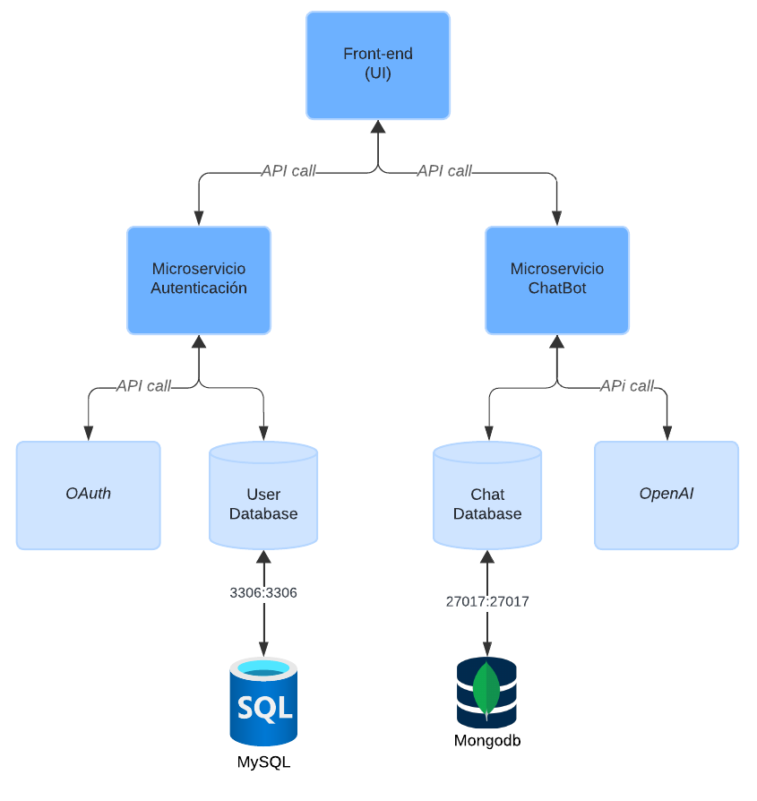
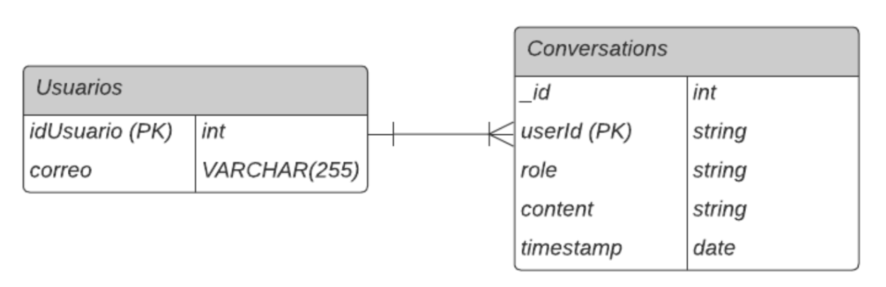
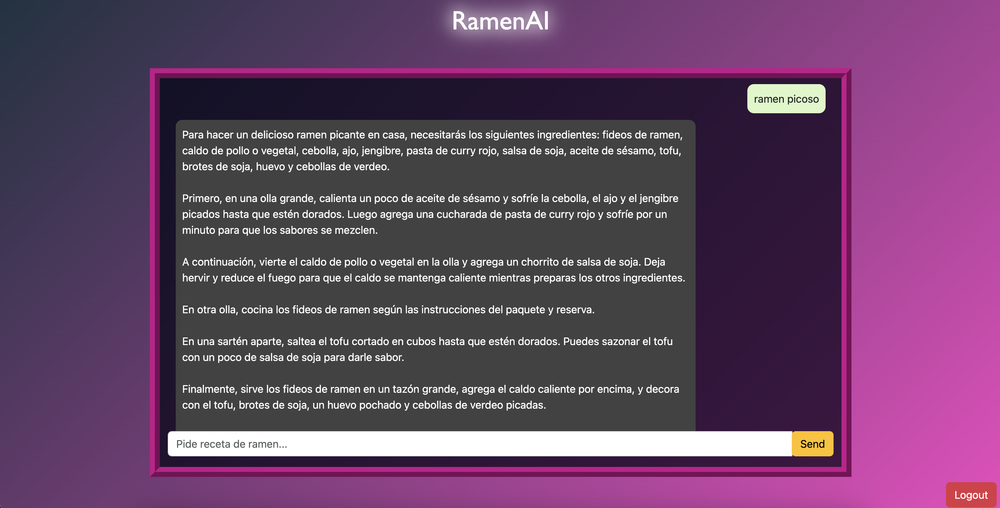

# Integración de un LLM en una arquitectura por microservicios.

## Descripción

En este proyecto se implementó una arquitectura de microservicios integrando un LLM en Flask. El proyecto consta de los siguientes microservicios:

- Servicio de autenticacion
- Servicio de chat

Adicionalmente, durante el desarrollo del proyecto se buscó que la arquitectura cumpliera con los cuatro atributos de calidad esenciales: modificabilidad, comprobabilidad, seguridad y capacidad de despliegue, que serán detallados más adelante.

### RamenAI

RamenAI consiste en un chatbot enfocado a entusiastas del ramen. El chat genera recomendaciones y diferentes recetas de acuerdo a tus gustos y basado en el historial de conversaciones pasadas de cada usuario.

## Diagramas 

### Diagrama de la Arquitectura



### Diagrama Entidad Relación de Bases de Datos




# Guía de despliegue de Docker

### Prerequisitos

- Docker
- MongoDB uri

Paso 1: Clonar el repositorio
```
git clone https://github.com/SVA-BL00/RamenAI.git
```
Paso 2: Crear el Archivo .env
```
OPENAI_API_KEY = "your_api_key"
MONGO_URI = "your_mongodb_uri"
GOOGLE_CLIENT_ID=your_google_client_id
GOOGLE_CLIENT_SECRET=your_google_client_secret
```
Paso 3: Desplegar la Arquitectura con Docker Compose
```
docker-compose up --build
```

# RamenAI



